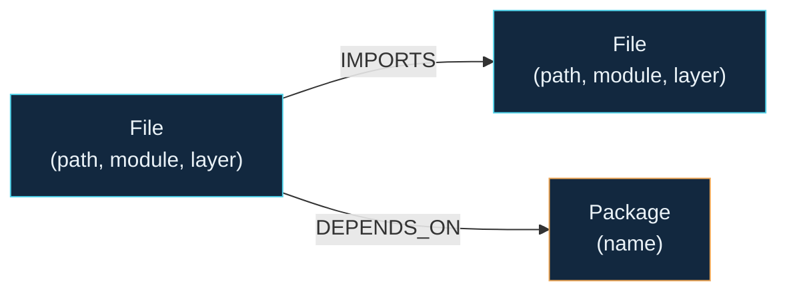

# Dependency Analyzer

> **Visualize your TypeScript codebase's dependency graph and answer the age-old question: "What breaks if I change this piece of code?"**

[](https://opensource.org/licenses/MIT)
[](https://www.typescriptlang.org/)
[](https://neo4j.com/)
[](https://nestjs.com/)
[](https://reactjs.org/)
[](https://vitejs.dev/)
[](http://makeapullrequest.com)
---

## Table of Contents

* [Overview](#overview)
* [Why This Exists](#why-this-exists)
* [Real Data, Not Fixtures](#real-data-not-fixtures)
* [Why a Graph Database?](#why-a-graph-database)
* [Data Model](#data-model)
* [Architecture](#architecture)
* [Setup & Run](#setup--run)
* [Core Queries Explained](#core-queries-explained)
* [UI](#ui)
* [Design Notes & Known Limitations](#design-notes--known-limitations)
* [Tech Stack](#tech-stack)
---

## Overview

**Dependency Analyzer** is A tool that turns a TypeScript codebase's import graph into something you can actually query and explore.

Select a file and instantly see what depends on it, how deeply those dependencies are connected, and which parts of the codebase could be affected by a change.

The project is backed by [CognoDB](https://console.cognodb.com) and uses a graph model to make relationship-heavy questions natural to query.

---

## Why This Exists

Every developer has asked:

> **"What happens if I change this file?"**

Answering that question usually means relying on memory, running `grep` / "Find Usages", or making the change and hoping CI catches anything you missed.

Dependency Analyzer answers it directly.

### Key Insights

* **Blast Radius** — Find everything that depends on a file, up to 5 levels deep.
* **Circular Dependencies** — Detect import cycles across the codebase.
* **Hotspots** — Identify files with high fan-in and potentially high impact.
* **Module Coupling** — See how different modules depend on each other.
* **Package Impact** — Explore which files could be affected by a dependency upgrade.


---

## Real Data, Not Fixtures

The graph is populated from a **real TypeScript backend**: my project [BuyBuddy](https://github.com/raghadislam/BuyBuddy), an Express + Prisma e-commerce API.

The seed pipeline statically parses the repository and builds the dependency graph automatically rather than relying on manually created or synthetic data.

One particularly surprising result:

> `modules/brand/brand.type.ts` transitively reaches **54 of 142 files (38%)**, 7 hops deep — including auth middleware, chat sockets, and background job workers.

That's difficult to discover by simply looking at the file itself.

---

## Why a graph database?

The core question is:

> **"What depends on this, transitively?"**

This is a variable-depth graph traversal problem, which is where a graph database provides a natural fit and relational databases are structurally bad at it.

### 1. Variable-depth traversal

We don't know how many dependency levels we may need to traverse in advance.

With Cypher:

```cypher
(target)<-[:IMPORTS*1..5]-(dependent)
```

The traversal depth is expressed directly in the query,
while in SQL, you need to self-join the `imports` table once per hop, or write a recursive CTE with manual visited-set bookkeeping to avoid infinite loops on cycles.


### 2. Multiple relationship types

A package-impact query can start at a `Package`, move into files through `DEPENDS_ON`, and then traverse backwards through `IMPORTS`.

```text
Package
   ↓ DEPENDS_ON
File
   ↑ IMPORTS
File
   ↑ IMPORTS
...
```

The relationship itself is part of the query rather than something reconstructed through multiple joins.


### 3. Cycle detection

Import cycles are naturally expressed as a path that returns to its starting node:

```cypher
(f:File)-[:IMPORTS*2..8]->(f)
```

The same traversal model used for dependency analysis can therefore be used to detect cycles.

---


## Data model



A concrete instance from the seed data — the real chain behind `auth.service.ts`'s blast radius:


### Nodes
| Label | Properties | Notes |
|---|---|---|
| `File` | `path` (unique), `module`, `layer` | `module` = business domain (`auth`, `cart`, `chat`...), inferred from folder structure. `layer` = architectural role (`controller`, `service`, `route`, `validation`...), inferred from filename convention. |
| `Package` | `name` (unique) | External npm dependency (or Node built-in) imported by a `File`. |

### Relationships

```text
(File)-[:IMPORTS]->(File)
(File)-[:DEPENDS_ON]->(Package)
```

Both relationships represent dependency direction: the source node depends on the target.

## Architecture

```
dependency-analyzer/
├── backend/                 NestJS API + seed pipeline
│   └── src/
│       ├── neo4j/           Driver wiring, parameterized read/write helpers
│       ├── health/          GET /health/db — connectivity check
│       ├── files/           Blast-radius / dependency / graph endpoints
│       ├── insights/        Cycles, hotspots, module coupling, package impact
│       ├── common/filters/  Global exception filter (DB-down -> clean 503)
│       └── seed/            AST parser + CognoDB loader + CLI entry
└── frontend/                React + TypeScript (Vite)
    └── src/
        ├── api/client.ts    Typed fetch wrapper, one error path for the whole app
        ├── hooks/           DB health polling
        └── components/      Radial graph visualization, panels, app shell
```

The seed script is a standalone tool rather than part of the running API.

It can be pointed at any TypeScript repository with the same module structure using:

```bash
--repo <path>
```
---

## Setup & run

### 1. Create your CognoDB instance
1. Sign up at [console.cognodb.com/signup](https://console.cognodb.com/signup)
2. Create an instance.
3. Copy the connection URI and the generated password for user `cognodb`.

### 2. Backend
```bash
cd backend
npm install
cp .env.example .env
# edit .env: COGNODB_URI, COGNODB_USER=cognodb, COGNODB_PASSWORD
npm run start:dev
```

### 3. Seed the graph
The seed script parses a target TypeScript repo and loads it into CognoDB. This repo doesn't vendor a copy of the target codebase — clone it as a sibling folder:
```bash
# from the repo root
git clone https://github.com/raghadislam/BuyBuddy ./BuyBuddy
cd backend
npm run seed -- --repo ../BuyBuddy --reset
```
The seed process prints a summary of:

* Files discovered
* Packages discovered
* Relationships created
* Unresolved imports

`--reset` clears existing graph data before seeding.

Omit it to merge into an existing graph.

### 4. Frontend
```bash
cd frontend
npm install
cp .env.example .env
# edit .env
npm run dev
```

## Core Queries Explained

All queries use the official `neo4j-driver` with parameterized values. No user input is directly concatenated into Cypher.

### Blast Radius

`GET /files/blast-radius` 
Find everything that depends on a target file:

```cypher
MATCH p = (target:File {path: $path})<-[:IMPORTS*1..5]-(dependent:File)
WITH dependent, min(length(p)) AS hops
RETURN dependent.path AS path, dependent.module AS module, dependent.layer AS layer, hops
ORDER BY hops ASC, path ASC
```

### Import cycles

`GET /insights/cycles` 
Finds cycles by matching a path of imports that loops back to the same file:

```cypher
MATCH p = (f:File)-[:IMPORTS*2..8]->(f)
RETURN DISTINCT [n IN nodes(p) | n.path] AS cycle
LIMIT 20
```

### Package Impact

`GET /insights/packages/impact`
Start from a package and traverse into all potentially affected files:

```cypher
MATCH (:Package {name: $packageName})<-[:DEPENDS_ON]-(direct:File)
MATCH p = (direct)<-[:IMPORTS*0..5]-(affected:File)
WITH affected, min(length(p)) AS hops
RETURN affected.path AS path, affected.module AS module, affected.layer AS layer, hops
ORDER BY hops ASC, path ASC
```

### Cross-Module Coupling

`GET /insights/module-coupling`
Show dependencies between different business modules:

```cypher
MATCH (a:File)-[:IMPORTS]->(b:File)
WHERE a.module <> b.module
RETURN a.module AS fromModule, b.module AS toModule, count(*) AS edgeCount
ORDER BY edgeCount DESC
```

### Variable-Length Query Limitation

One documented exception exists to the "no string-concatenated Cypher" rule.

`maxHops` must be interpolated into the query because openCypher does not support parameters for variable-length path bounds.

The application mitigates this by validating `maxHops` through `class-validator` and restricting it to an integer between **1 and 8** before it reaches the query.


## UI


The UI is simple and inspired by something I personally love: the Aurora Borealis / Northern Lights.

### Blast Radius tab

* Search for a file.
* Switch between **"what breaks if I change this?"** and **"what this relies on"**.
* Visualize dependencies as concentric rings.
* Each ring represents another level of dependency.
* Click any node to re-center the graph.

### Insights tab

The Insights dashboard provides:

* Riskiest files to touch (highest fan-in).
* Any import cycles found.
* A cross-module coupling table.
* A package-impact analysis.


The UI also explicitly handles:

* Loading states
* Empty states
* Error states
* Database connectivity failures
* Retry behavior


## Design notes & known limitations

- **File-level granularity only** — no function/class-level `CALLS` graph. This was a deliberate scope decision for a 48-hour window; the schema and parser are structured so function-level nodes could be added later without reworking the core model.
- **Node built-ins (`fs`, `path`, `http`) are modeled as `Package` nodes** alongside real npm dependencies, since they're bare-specifier imports too. A `builtin: boolean` property would be a quick follow-up to distinguish them.
- **No test-coverage graph** — the seed repo has no tests, so `Test`/`TESTED_BY` nodes were dropped rather than fabricated.
- Constraint creation (`CREATE CONSTRAINT ... IF NOT EXISTS`) in the seed script is wrapped in a try/catch, since some managed tiers restrict DDL — a failure there logs a warning but doesn't abort the seed.

---

## Tech Stack

| Layer           | Technology                          |
| --------------- | ----------------------------------- |
| Language        | TypeScript                          |
| Backend         | NestJS                              |
| Frontend        | React + Vite                        |
| Graph Database  | CognoDB                             |
| Database Driver | `neo4j-driver`                      |
| Parsing         | TypeScript AST                      |
| Validation      | `class-validator`                   |
| Visualization   | Interactive radial dependency graph |
