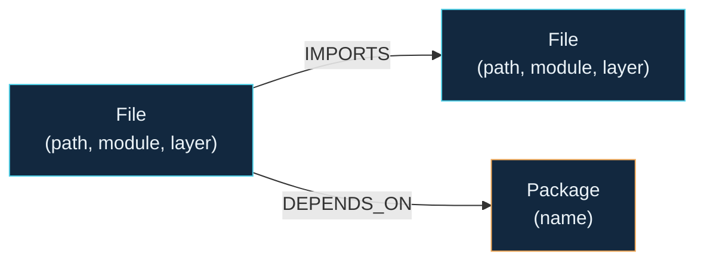
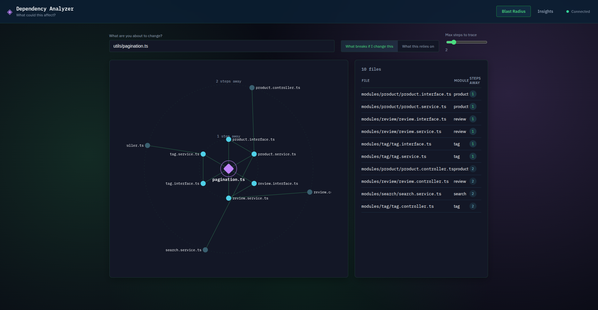
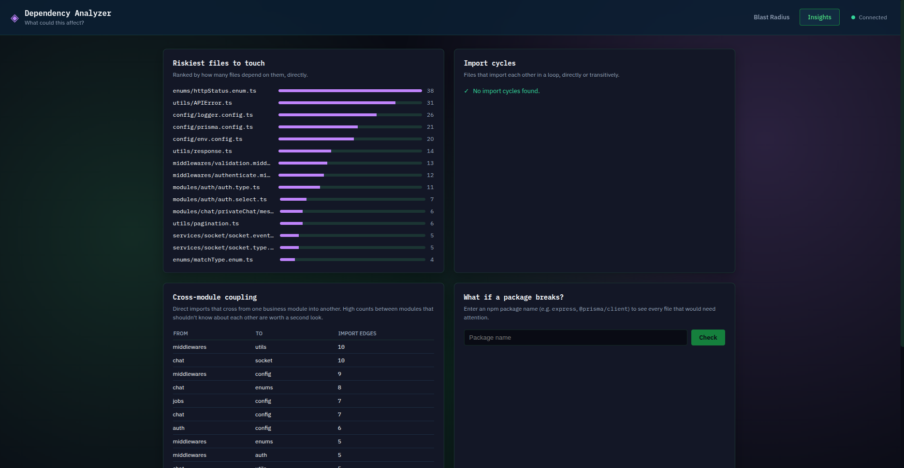

# Dependency Analyzer

**Visualize your TypeScript codebase's dependency graph and answer the age-old question: "What breaks if I change this piece of code?"**

[](https://opensource.org/licenses/MIT)
[](https://www.typescriptlang.org/)
[](https://neo4j.com/)
[](https://nestjs.com/)
[](https://reactjs.org/)
[](https://vitejs.dev/)
[](http://makeapullrequest.com)
---

## What Is It?

**Dependency Analyzer** is A tool that turns a TypeScript codebase's import graph into something you can actually query and explore, you pick a file and see, live, everything that depends on it and how many steps away.

## The use case

Every developer has asked "what happens if I touch this file?" right before making a change. The honest answer usually requires either perfect memory of the codebase, a slow chain of manual `grep`/"find usages", or just being brave and finding out in CI. This tool answers it directly: pick a file, and it shows you:

- **Blast radius** — all files that depend on a file, up to 5 levels deep
- **Circular dependencies** — find import cycles in your codebase
- **Hotspots** — files with high fan-in (many files depend on them)
- **Module coupling** — see dependencies between modules
- **Package impact** — what breaks if you upgrade a dependency

The project is backed by [CognoDB](https://console.cognodb.com) and uses a graph model to make relationship-heavy questions natural to query.

The seed data is **real**: it's generated by statically parsing an actual TypeScript backend (My [BuyBuddy](https://github.com/raghadislam/BuyBuddy) Repo, an Express + Prisma e-commerce API) , not synthetic fixtures.

## Why a graph database?

The core question — "what depends on this, transitively?" — is a variable-depth reachability question. That's the one thing relational schemas are structurally bad at:

- **You don't know the depth in advance.** A relational answer means self-joining the `imports` table once per hop, or writing a recursive CTE with manual visited-set bookkeeping to avoid infinite loops on cycles. In Cypher, it's one line: `(target)<-[:IMPORTS*1..5]-(dependent)`, and the hop bound makes cycle-safety free — the query terminates by construction.
- **The interesting queries mix relationship types.** "What breaks if package X ships a breaking change?" starts at a `Package` node, hops once over `DEPENDS_ON` into files, then walks `IMPORTS` backward an unknown number of times. In SQL, that's a different join shape depending on how deep you need to go — decided at query-writing time, not query-running time.
- **Cycle detection is a first-class query, not a special case.** `(f:File)-[:IMPORTS*2..8]->(f)` finds import cycles directly — the same pattern any traversal uses, just closed into a loop. The relational equivalent needs a recursive CTE that explicitly tracks visited nodes to terminate.

This isn't a hypothetical advantage. Running this exact tool against the real seed repo surfaced a genuinely surprising result: **`modules/brand/brand.type.ts`, an unremarkable type-definitions file, transitively reaches 54 of the repo's 142 files (38%) — 7 hops deep, touching everything from auth middleware to chat sockets to background job workers.** No one editing that file would guess that from reading it. That's the entire pitch for this tool, and the entire pitch for a graph over a relational table of `(importer, imported)` pairs: the relationships *are* the data you care about, not metadata bolted onto rows.

## Data model



A concrete instance from the seed data — the real chain behind `auth.service.ts`'s blast radius:


**Node properties:**
| Label | Properties | Notes |
|---|---|---|
| `File` | `path` (unique), `module`, `layer` | `module` = business domain (`auth`, `cart`, `chat`...), inferred from folder structure. `layer` = architectural role (`controller`, `service`, `route`, `validation`...), inferred from filename convention. |
| `Package` | `name` (unique) | External npm dependency (or Node built-in) imported by a `File`. |

**Relationships:** `(File)-[:IMPORTS]->(File)`, `(File)-[:DEPENDS_ON]->(Package)` — both direction = "depends on".

No `Test`/`TESTED_BY` nodes: the seed repo has no test suite, and fabricating one would violate the "real data" goal.

## Architecture

```
dependency-analyzer/
├── backend/                 NestJS API + seed pipeline
│   └── src/
│       ├── neo4j/           Driver wiring, parameterized read/write helpers
│       ├── health/          GET /health/db — connectivity check
│       ├── files/           Blast-radius / dependency / graph endpoints
│       ├── insights/        Cycles, hotspots, module coupling, package impact
│       ├── common/filters/  Global exception filter (DB-down -> clean 503)
│       └── seed/            AST parser + CognoDB loader + CLI entry
└── frontend/                React + TypeScript (Vite)
    └── src/
        ├── api/client.ts    Typed fetch wrapper, one error path for the whole app
        ├── hooks/           DB health polling
        └── components/      Radial graph visualization, panels, app shell
```

The seed script is a standalone tool, not part of the running API — it's meant to be re-run whenever the target repo changes, pointed at any TypeScript project via `--repo <path>`, not hardcoded to BuyBuddy.

## UI & Design

The UI is inspired by something I personally love: the Aurora Borealis / Northern Lights.


## Setup & run

### 1. Create your CognoDB instance
1. Sign up at [console.cognodb.com/signup](https://console.cognodb.com/signup) (no credit card needed for the free tier).
2. Create a free **c0** instance, pick a region, wait ~1 minute for provisioning.
3. Copy the connection URI (`bolt+s://<instance-id>.databases.cognodb.cloud`) and the generated password for user `cognodb` — **the password is shown once**.

### 2. Backend
```bash
cd backend
npm install
cp .env.example .env
# edit .env: COGNODB_URI, COGNODB_USER=cognodb, COGNODB_PASSWORD
npm run start:dev
# API listening on http://localhost:3000
```

### 3. Seed the graph
The seed script parses a target TypeScript repo and loads it into CognoDB. This repo doesn't vendor a copy of the target codebase — clone it as a sibling folder:
```bash
# from the repo root
git clone https://github.com/raghadislam/BuyBuddy ../BuyBuddy
cd backend
npm run seed -- --repo ../BuyBuddy --reset
```
This prints a summary (files/packages/edges found, any unresolved imports) before writing anything. `--reset` clears existing graph data first; omit it to merge into an existing graph.

### 4. Frontend
```bash
cd frontend
npm install
cp .env.example .env
# edit .env: VITE_API_BASE_URL=http://localhost:3000 (or your deployed backend URL)
npm run dev
# App at http://localhost:5173
```

## The queries, explained

All queries are parameterized via the official `neo4j-driver` — no string-concatenated Cypher, with one documented exception below.

**Blast radius** (`GET /files/blast-radius`) — the core feature. Multi-hop reverse traversal:
```cypher
MATCH p = (target:File {path: $path})<-[:IMPORTS*1..5]-(dependent:File)
WITH dependent, min(length(p)) AS hops
RETURN dependent.path AS path, dependent.module AS module, dependent.layer AS layer, hops
ORDER BY hops ASC, path ASC
```

**Import cycles** (`GET /insights/cycles`) — the "awkward in SQL" query. A path back to its own start node:
```cypher
MATCH p = (f:File)-[:IMPORTS*2..8]->(f)
RETURN DISTINCT [n IN nodes(p) | n.path] AS cycle
LIMIT 20
```

**Package impact** (`GET /insights/packages/impact`) — mixes two relationship types across one traversal:
```cypher
MATCH (:Package {name: $packageName})<-[:DEPENDS_ON]-(direct:File)
MATCH p = (direct)<-[:IMPORTS*0..5]-(affected:File)
WITH affected, min(length(p)) AS hops
RETURN affected.path AS path, affected.module AS module, affected.layer AS layer, hops
ORDER BY hops ASC, path ASC
```

**Cross-module coupling** (`GET /insights/module-coupling`) — an architecture-health view, not part of the original brief but a natural extension once the graph exists:
```cypher
MATCH (a:File)-[:IMPORTS]->(b:File)
WHERE a.module <> b.module
RETURN a.module AS fromModule, b.module AS toModule, count(*) AS edgeCount
ORDER BY edgeCount DESC
```

**A documented exception to "no string-concatenated Cypher":** `maxHops` (the `*1..N` bound) is interpolated into the query text rather than passed as `$maxHops`. This isn't a choice — openCypher doesn't support parameters for variable-length path bounds, they must be literals. The mitigation: a `class-validator` DTO (`TraversalQueryDto`/`GraphQueryDto`) clamps `maxHops` to an integer between 1 and 10 *before* it reaches the query string, so it's a validated literal, never raw user input.

## UI tour


The UI is simple and inspired by something I personally love: the Aurora Borealis / Northern Lights.


- **Blast Radius tab** — search for a file, toggle between "what breaks if I change this" and "what this relies on", and see the result as concentric rings (each ring = one more step away) with the real import edges drawn between them. Click any node to re-center on it.
- **Insights tab** — riskiest files to touch (highest fan-in), any import cycles found, a cross-module coupling table, and a package-impact search.
- Loading, empty (leaf files reframed as "safe to change freely"), and error states (CognoDB unreachable → a clear banner with a retry button, polled automatically) are all handled explicitly.




## Design notes & known limitations

- **File-level granularity only** — no function/class-level `CALLS` graph. This was a deliberate scope decision for a 48-hour window; the schema and parser are structured so function-level nodes could be added later without reworking the core model.
- **Node built-ins (`fs`, `path`, `http`) are modeled as `Package` nodes** alongside real npm dependencies, since they're bare-specifier imports too. A `builtin: boolean` property would be a quick follow-up to distinguish them.
- **No test-coverage graph** — the seed repo has no tests, so `Test`/`TESTED_BY` nodes were dropped rather than fabricated.
- Constraint creation (`CREATE CONSTRAINT ... IF NOT EXISTS`) in the seed script is wrapped in a try/catch, since some managed tiers restrict DDL — a failure there logs a warning but doesn't abort the seed.

